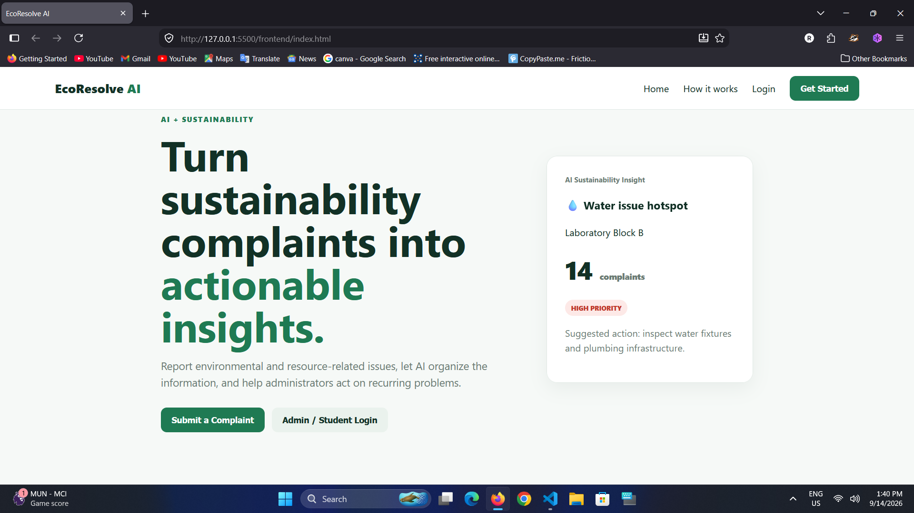
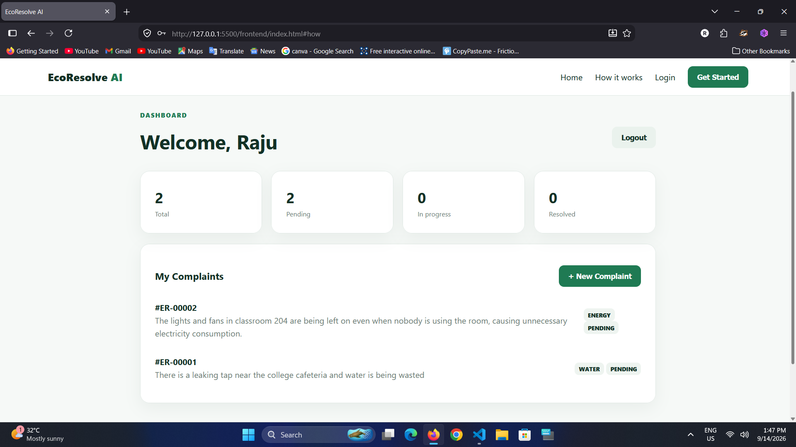
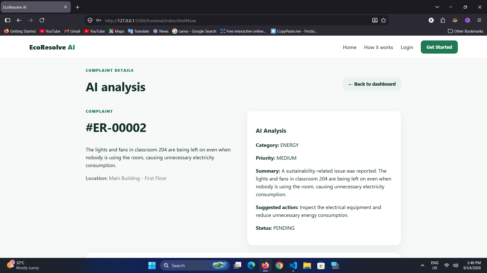
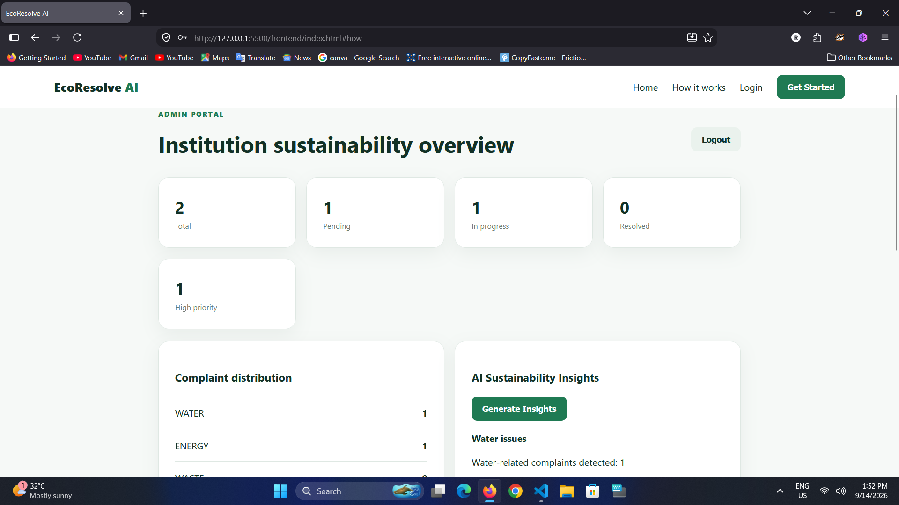
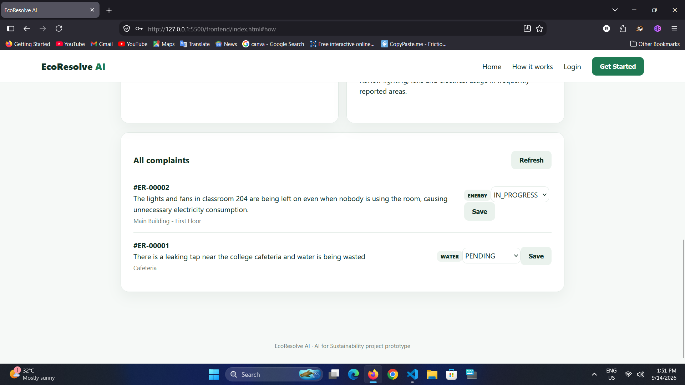
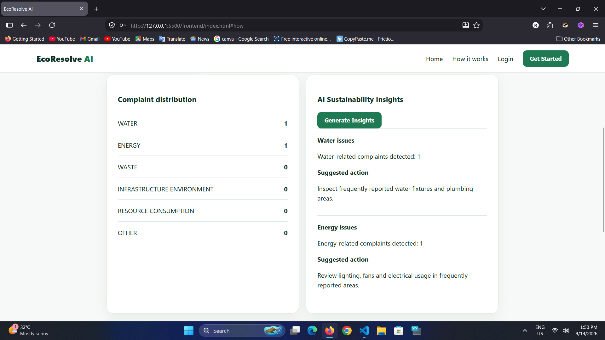

# EcoResolve AI

### AI-Powered Sustainability Complaint Analyzer

EcoResolve AI is a simple web-based platform for reporting and managing sustainability-related problems in an institution.

Students can report issues such as water leakage, unnecessary electricity usage, waste problems, or other environmental concerns. The system uses AI to analyze the complaint and suggest a category, priority, and possible action.

An admin can review the complaint, make changes if needed, and update its status.

## Problem

In colleges and other institutions, small sustainability problems can easily go unnoticed or take time to reach the right person.

For example:

- A leaking tap may continue wasting water.
- Lights or fans may be left on unnecessarily.
- Waste may not be properly managed.
- Repeated problems may be difficult to identify.

EcoResolve AI aims to make this reporting and review process more organized.

## How It Works

1. A student logs in and submits a complaint.
2. The system analyzes the complaint using AI.
3. The complaint is given a category and priority.
4. An admin reviews the complaint and takes action.
5. The status can be updated until the issue is resolved.
6. The admin dashboard provides basic information about reported issues.

## Main Features

- Student registration and login
- Sustainability complaint submission
- AI-based complaint classification
- AI-based priority suggestion
- Suggested action for the complaint
- Admin dashboard
- Complaint status management
- Basic analytics
- Sustainability insights

## AI Used

The current prototype uses a small rule-based AI component for the demonstration.

It identifies keywords and patterns in a complaint to suggest:

- Complaint category
- Priority
- Summary
- Recommended action

The AI part is kept separate in the backend so that it can be replaced with an approved AI/Granite-based service in the future.

## IBM BOB

IBM BOB was used during the development of the project.

It helped with:

- Understanding and navigating the project code
- Organizing reusable development skills
- Supporting development tasks
- Maintaining development rules and instructions

The project also includes the BOB-related files and skills used during development.

## SDG Connection

The main SDG connected with EcoResolve AI is:

**SDG 11 – Sustainable Cities and Communities**

The project also has relevance to:

- SDG 6 – Clean Water and Sanitation
- SDG 7 – Affordable and Clean Energy
- SDG 12 – Responsible Consumption and Production

## Responsible AI

The system is designed with human review in mind.

AI suggestions are not treated as final decisions. An admin can review and change the suggested category or priority before taking action.

The project also considers:

- Privacy of user information
- Transparency of AI suggestions
- Human oversight
- Fair treatment of complaints

## Prototype Screenshots

### Home Page



### Student Dashboard



### AI Analysis



### Admin Dashboard



### Complaint Management



### Analytics and Insights



## Technology Used

- Java
- Spring Boot
- Spring Security
- H2 Database
- HTML
- CSS
- JavaScript
- Maven
- Git/GitHub

## Project Structure

```text
EcoResolve-AI/
├── backend/
├── frontend/
├── db/
├── dobb/
├── docs/
├── screenshots/
├── README.md
└── agent.md